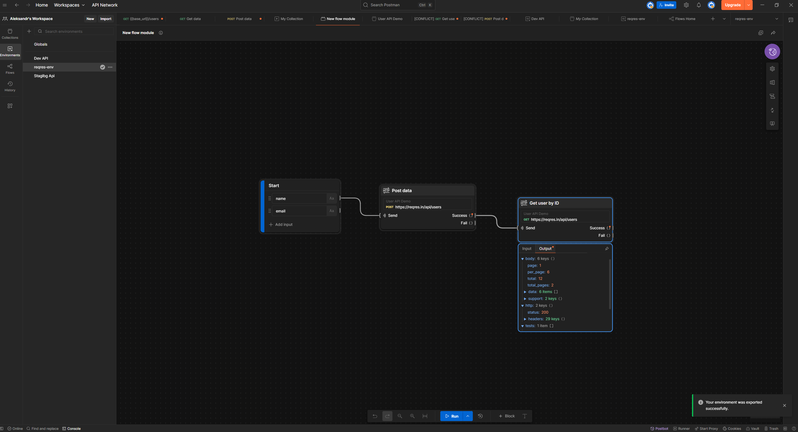

# 🧪 Postman Flow — User Creation & Verification

This project demonstrates an end-to-end **Postman Flow** for working with a user API.  
It includes user creation, saving the returned `id`, and verifying the user data using that ID.

---

## 🔁 Flow Overview

1. **POST `/users`**
   - Creates a new user with `name` and `email`
   - Extracts the `id` from the response
   - Stores the `id` in a variable (`userid`) for later use

2. **GET `/users/{{userid}}`**
   - Uses the previously saved `userid`
   - Validates that the user was successfully created

---

## 📂 Files

- `user-api.postman_collection.json` — Postman collection with two main requests
- `user-api-environment.json` — Environment variables (e.g., `token`, `base_url`, `userid`)
- `flow-screenshot.png` — Visual overview of the Postman Flow
- `README.md` — This documentation file

---

## 🚀 How to Run

1. Import the collection and environment into Postman
2. Set your `name`, `email`, and `token` in the environment
3. Run the Flow or execute the requests manually

---

## 📸 Flow Preview

